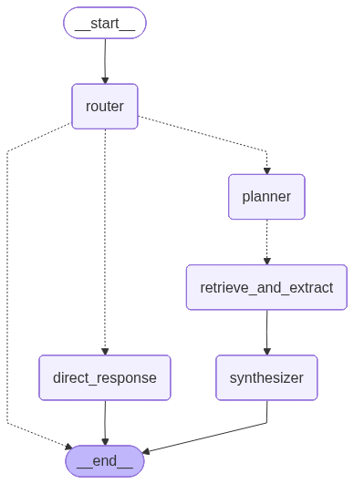
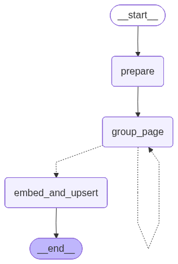

# Diwan — Arabic Financial Document Q&A

An agentic RAG system for Arabic-language Q&A over financial and regulatory documents. Answers questions grounded strictly in the document corpus, refuses off-domain queries politely, and cites every factual claim with a source and page number.

**Covered documents:**
- Egyptian Accounting Standards 2020 — معايير المحاسبة المصرية ٢٠٢٠
- CIB Bank Standalone Financial Statements — القوائم المالية المنفردة لبنك CIB

---

## Architecture Overview


The system has two independent pipelines: an **ingestion pipeline** that runs once per document, and a **query pipeline** that runs on every user message.

### Query Pipeline

Every incoming query is classified by a router before any retrieval runs. The route determines what happens next:

| Route | Meaning | Action |
|---|---|---|
| `اجتماعي` | Greetings, small talk | Direct LLM response |
| `عام` | Questions about the system itself | Direct LLM response |
| `مالي_مباشر` | Answer already present (with citations) in chat history | Direct LLM response from history |
| `مالي_استرجاع` | In-scope question requiring corpus search | Agentic RAG pipeline |
| `خارج_النطاق` | Off-domain question | Polite redirect |

`مالي_استرجاع` queries enter a LangGraph pipeline:

```
Router
  └─► Planner  (decomposes query into disjoint sub-queries)
        └─► [Worker 1 ... Worker N]  (parallel, via LangGraph Send)
              each: Retriever (hybrid search + rerank) → Extractor (select relevant chunks)
        └─► Lookup  (deduplicate + assemble context)
              └─► Synthesizer  (Arabic prose + numbered citations)
```



### Ingestion Pipeline

Documents are parsed, chunked, embedded, and stored in Qdrant before the system is used. The chunking step for the financial statements uses a LangGraph loop that groups layout-detected bboxes into semantically coherent retrieval units page by page:



---

## Tech Stack

| Layer | Technology |
|---|---|
| **LLM (router, extractor)** | OpenAI `gpt-5.4-mini` |
| **LLM (planner, synthesizer)** | OpenAI `gpt-5.4` |
| **Embedding** | BGE-M3 via `FlagEmbedding` (dense + sparse, 1024-dim) |
| **Reranking** | `BAAI/bge-reranker-v2-m3` cross-encoder |
| **Vector store** | Qdrant (hybrid search with RRF fusion) |
| **Pipeline orchestration** | LangGraph |
| **Chat history** | Redis (LangGraph Redis checkpointer) |
| **Document parsing** | LandingAI ADE (`dpt-2`) |
| **UI** | Chainlit |
| **Observability** | Langfuse v2 (self-hosted) |

All local services run via Docker Compose. Only LLM API calls leave local infrastructure — raw documents, vectors, and chat history stay on-device.

---

## Project Layout

```
diwan/
├── ingestion/
│   └── chunker.py           # LangGraph chunking loop (qawaim)
├── retrieval/
│   └── retriever.py         # Hybrid search + rerank (pure function)
├── pipeline/
│   ├── nodes/
│   │   ├── router.py        # Query classifier (5 routes)
│   │   ├── planner.py       # Sub-query decomposer
│   │   ├── extractor.py     # Chunk selector per sub-query
│   │   ├── lookup.py        # Context assembler (in-memory join)
│   │   └── synthesizer.py   # Answer + citation generator
│   └── graph.py             # LangGraph graph wiring
└── app.py                   # Chainlit UI entry point
scripts/
├── run_ingestion.py         # LandingAI ADE document parsing
├── build_markdown.py        # JSON → markdown conversion
└── upsert_mohasaba.py       # Embed + upsert accounting standards
data/
├── indecies/mohasaba/       # Pre-chunked accounting standards sections
├── qawaim_parsed/           # Parsed CIB financial statements
└── qdrant/ redis/ postgres/ # Bind-mounted Docker volumes
docs/
├── ARCHITECTURE_SIMPLIFIED.md
├── plan.md
├── Diagram.png
├── core_graph.png
└── chunker_graph.png
```

---

## Setup

### Prerequisites

- Python 3.12+
- [uv](https://docs.astral.sh/uv/) package manager
- Docker + Docker Compose
- CUDA-capable GPU (for local BGE-M3 and reranker inference)
- OpenAI API key
- LandingAI API key (ingestion only)

### 1. Clone and install

```bash
git clone <repo-url>
cd diwan
uv sync
```

### 2. Configure environment

Create a `.env` file in the project root:

```env
OPENAI_API_KEY=sk-...
LANDINGAI_API_KEY=...           # ingestion only

# Langfuse (get from http://localhost:3000 after starting services)
LANGFUSE_PUBLIC_KEY=pk-lf-...
LANGFUSE_SECRET_KEY=sk-lf-...
LANGFUSE_HOST=http://localhost:3000

# Optional: override Langfuse Postgres credentials
POSTGRES_USER=langfuse
POSTGRES_PASSWORD=langfuse
POSTGRES_DB=langfuse
LANGFUSE_NEXTAUTH_SECRET=change-me
LANGFUSE_SALT=change-me
```

### 3. Start local services

```bash
docker compose up -d
```

| Service | URL |
|---|---|
| Qdrant | `http://localhost:6333` |
| Langfuse | `http://localhost:3000` |
| Redis | `localhost:6379` |
| Postgres | `localhost:5432` |

Open Langfuse at `http://localhost:3000`, create an account, and copy the public/secret keys into `.env`.

### 4. Ingest documents

**Accounting standards (معايير المحاسبة):**

```bash
uv run python scripts/upsert_mohasaba.py
```

**CIB financial statements (القوائم المالية):**

```bash
# Parse the PDF via LandingAI ADE (requires LANDINGAI_API_KEY)
uv run python scripts/run_ingestion.py

# Convert parsed output to markdown
uv run python scripts/build_markdown.py

# Run the LangGraph chunker loop: chunk → embed → upsert to Qdrant
uv run python -c "from diwan.ingestion.chunker import run_chunker; run_chunker()"
```

### 5. Run the app

```bash
uv run chainlit run diwan/app.py
```

Chat UI available at `http://localhost:8000`.

---

## Retrieval Details

Each `مالي_استرجاع` query goes through five stages:

1. **Planner** — decomposes the query into the minimum set of disjoint sub-queries needed for full coverage
2. **Retrieval** (parallel per sub-query):
   - BGE-M3 encodes the sub-query → dense + sparse vectors in one forward pass
   - Qdrant hybrid search (RRF fusion of dense + sparse) → top-20 candidates
   - BGE-Reranker cross-encoder rescores → top-5
3. **Extractor** — selects only the chunk IDs relevant to the sub-query; no generation, no hallucination risk
4. **Lookup** — deduplicates selected chunks across all parallel workers, pairs each with its originating sub-query
5. **Synthesizer** — writes Arabic prose with `[1]`, `[2]` inline markers and a sources list (`document name, ص. N`)

---

## Observability

All LLM calls are traced in Langfuse (self-hosted — no data leaves local infrastructure). Each query produces a trace with the following spans:

| Span | Node |
|---|---|
| `router` | Route classification |
| `planner` | Sub-query decomposition |
| `extractor/{sub_query}` | One span per parallel worker |
| `synthesizer` | Final answer generation |
| `chunker/page_{n}` | Ingestion-time chunking (offline) |

---

## Running Tests

```bash
# Fast tests only
uv run pytest

# Include integration tests (requires running Qdrant)
uv run pytest -m integration

# Include slow embedding/ingestion tests
uv run pytest -m slow
```
